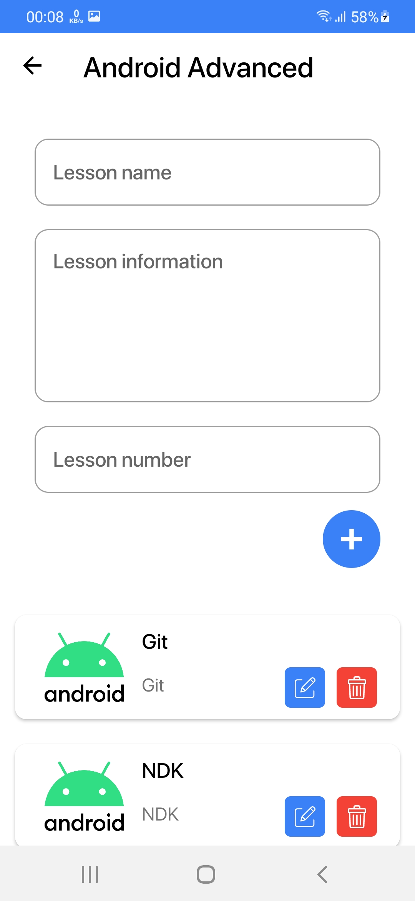

# IT Courses (with RxKotlin)

  
  
  
  
 

I made icons for application.

Resources:

<a href = "https://lottiefiles.com/53882-distance-education">LottieFiles</a>

<a href = "https://www.figma.com/file/538sW6zF9GBfasT1ZzEFhH/Untitled?node-id=0%3A1">Figma</a>
